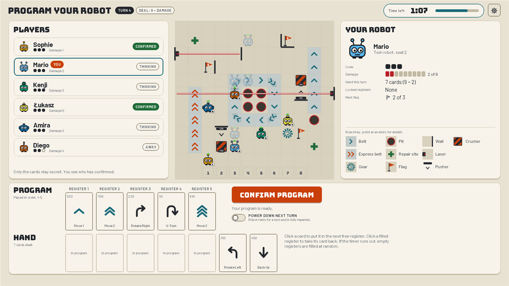
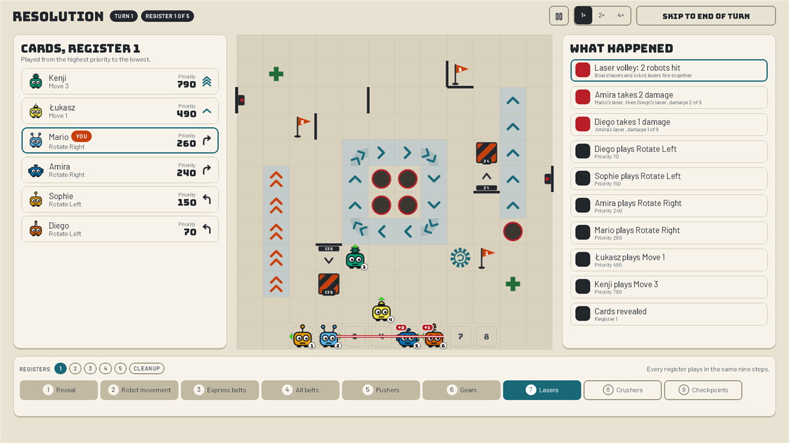
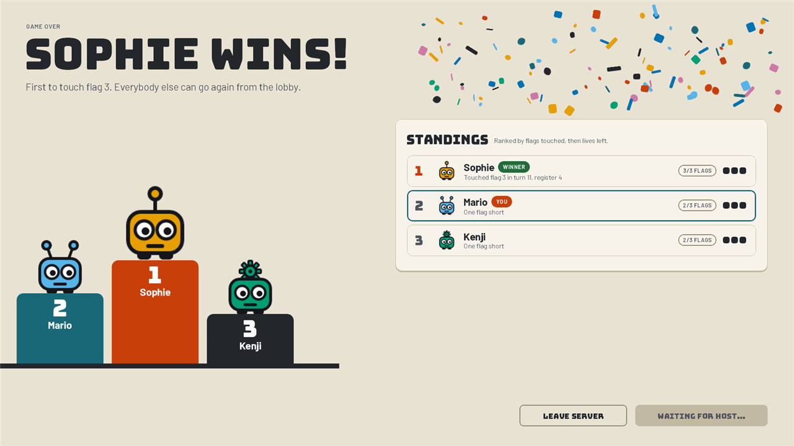

# Robot Rampage

**Plan carefully. Crash spectacularly.**

An online multiplayer take on the board game **RoboRally**, for 2–8 players. Each
turn, every player secretly programs their robot with five cards. Then all the
programs run at once, register by register, while conveyor belts, gears,
pushers, crushers, lasers and pits interfere. The first robot to touch every flag
in order wins. Most turns don't go to plan, and that's the game.



**Status:** playable end to end and playtested. Still pre-1.0: there's one
board, one game per server, and no persistence yet, so restarting the server
ends the running game.

## Features

- **Classic 2005 rules.** One shared 84-card deck with priority numbers. Damage
  shrinks your hand and locks your registers. Power down to repair, respawn at
  your archive marker, and you have three lives before you're out.
- **Simultaneous secret programming.** Other players only see *that* you've
  confirmed, never your cards. The server is authoritative, so hands never
  reach other clients.
- **A ghost path** shows where your cards will take your robot as you place them.
- **A step-by-step turn replay.** Every register plays through its phases
  (cards, movement, belts, pushers, gears, lasers, crushers, checkpoints) with a
  running "what happened" feed. You can pause it, play it at 1×/2×/4×, or skip
  to the end of the turn.
- **Nobody waits on a slow player.** The programming timer defaults to 90 s; the
  host can set it from 30 to 300 s in the lobby and pause it mid-game. Once
  everyone else has confirmed, the last player gets at most 30 s. When time runs
  out, empty registers are filled at random.
- **Drop-outs are handled.** A client that loses its connection reconnects
  automatically, and a client that was closed or crashed can rejoin its own
  seat after a restart. Either way there's a 10-minute grace period, and meanwhile the robot keeps playing with random programs.
- Sound effects, a results screen with standings, and a Settings dialog (volume,
  window size, replay speed, ghost path on/off).

| Turn replay (laser volley) | Game over |
|---|---|
|  |  |

## Playing

1. Download `RobotRampage-Client.zip` from the
   [latest release](https://github.com/mariokoehler/Robot-Rampage/releases/latest).
   It bundles its own Java runtime, so there's nothing else to install.
2. Unzip it and run `RobotRampage/RobotRampage.exe`. Windows SmartScreen may warn
   you because the exe is unsigned.
3. Enter a display name and a server address (`host:port`; the default port is
   `45725`). The client comes preconfigured with an address. Change it on the
   Connect screen to play on a different server.
4. In the lobby, everyone except the host marks themselves ready, then the
   host starts the game.

**To update**, run `update.cmd` in the install folder. It downloads the latest
release and replaces the install in place. **Client and server versions must
match exactly**: the server refuses a client from a different release. So only
update once the server you play on has moved to the same release.

The packaged client is Windows-only. On Linux or macOS you can build and run
from source (see below); those platforms are untested.

### How to play

The board has three numbered flags. Touch them in order; the first robot to
touch the last one wins.

Each turn you're dealt nine cards, minus one for each point of damage. Click a
card to put it in the next free register, and click a filled register to take it
back. When all five are filled, press **Confirm program**. Registers then run
1 → 5. Within each register, the highest priority number moves first, and after
the robots move, the board elements act. Robots push each other and block each
other's lasers. Falling into a pit, running off the board or taking ten damage
destroys your robot, and you return at your archive marker with one life less.
From five damage onwards your last registers lock in whatever card they
currently hold. Powering down for a turn repairs all of your damage.

The game is played with the mouse only. The full rules, including every edge
case and the exact order things happen in a register, are in section 2 of
[`design.md`](./design.md).

## Hosting a server

A server runs exactly one game at a time and listens on **TCP 45725** only.

**Docker** (image built by CI for every release):

```
docker run -d --name robotrampage-server -p 45725:45725 --restart unless-stopped \
  ghcr.io/mariokoehler/robotrampage-server:vX.Y.Z
```

Use the tag that **matches your players' client release**. Don't use `latest`,
because the version check is an exact match. `deploy/docker-compose.yml` does the
same as a compose file.

**Plain Java** (JDK/JRE 25). Releases don't include a server jar, so build it
first (see [Building from source](#building-from-source)):

```
java --enable-native-access=ALL-UNNAMED -jar RobotRampage-Server-<version>.jar [port] [seed]
```

Both arguments are optional. The server logs the game seed at startup (`game
seed N`). Starting a server with that seed reproduces its shuffles and random
fills, so include the seed in bug reports.

## Building from source

**Requirements:** JDK 25, Maven 3.9+.

```
mvn clean package
```

This builds the client and server jars and runs the tests. To run locally on
Windows:

```
start_server.cmd    # one terminal
start_client.cmd    # one per player
```

Or use the plain Maven commands on any platform:

```
mvn install -pl core -am -DskipTests
mvn -pl server compile exec:java      # one terminal
mvn -pl lwjgl3 compile exec:exec      # one per player
```

Re-run the `install` step after every change to `core`, and after every commit.
The version is computed from git history by
[jgitver](https://github.com/jgitver/jgitver-maven-plugin), so a stale install of
`core` stops matching. Both `.cmd` scripts reinstall it for you.

The client and server jars end up in `lwjgl3/target/RobotRampage-<version>.jar`
and `server/target/RobotRampage-Server-<version>.jar`. Run either with
`java --enable-native-access=ALL-UNNAMED -jar <jar>`.

## Making boards

A visual board editor lives in the `dev-tools` module. It's a developer tool
and isn't part of the game or its releases. Start it with
`start_board_editor.cmd` or:

```
mvn install -pl core -am -DskipTests
mvn -pl dev-tools compile exec:exec
```

It opens and saves 12×12 boards in `assets/boards/`, draws them exactly as the
game does, and checks them live with the same validator the game uses. Saving
is only possible once the board has no errors. For now, the server still always
plays `proving-grounds`. See section 3.13 of [`design.md`](./design.md) for how
the editor works.

## How it's built

- **[libGDX](https://libgdx.com/)** with the LWJGL3 desktop backend and plain
  Scene2D for the UI. The server uses the headless backend.
- **KryoNet** over TCP only. The game is turn-based, so there is no UDP and no
  client-side prediction.
- **Jackson** for board files and settings, and **JUnit 5 + ArchUnit** for tests.
- A **pure rules engine**: turn resolution is a deterministic function from
  state and programs to new state plus a list of events. It doesn't depend on
  libGDX or the network (ArchUnit enforces this). The server runs it, and the
  clients replay its event list as the turn animation.
- Boards are **JSON data** (`assets/boards/`), validated on load. The format is
  built to allow more boards and procedurally generated boards later.

| Path | Contents |
|---|---|
| `core/` | Rules engine, board format, protocol and session logic, client screens |
| `lwjgl3/` | Desktop client launcher, release packaging, dev tools (in `src/test`) |
| `server/` | Dedicated headless server and its Dockerfile |
| `dev-tools/` | Developer tools that are never shipped: the board editor |
| `assets/` | Everything the game loads at runtime (atlas, fonts, boards, sounds) |
| `assets-raw/` | Source art, never loaded by the game |
| `tools/` | Asset-import scripts |
| `deploy/` | Server deployment (Docker Compose) |

## Releasing

Pushing a `vX.Y.Z` tag triggers two GitHub Actions workflows.
`release-client.yml` builds the self-contained Windows zip with `jpackage` and
publishes it as a GitHub Release. `release-server.yml` builds the Docker image
and pushes it to `ghcr.io/mariokoehler/robotrampage-server`. Both build from the
same tag-derived version. Details are in sections 3.9, 3.11 and 3.12 of
`design.md`.

## Documentation

- **[`design.md`](./design.md)** covers the game rules and system architecture,
  the why as well as the what. Read it first.
- **[`CLAUDE.md`](./CLAUDE.md)** holds working notes for the AI-assisted
  development process: build gotchas, testing conventions and decisions made
  along the way. Useful to anyone, human or AI, picking up work on the code.

## License

Robot Rampage is licensed under the
[PolyForm Noncommercial License 1.0.0](./LICENSE.md). You may use, copy, modify
and share it for any **non-commercial** purpose, as long as you keep the
copyright notice and the license with it. Selling it or using it commercially is
not allowed.

Some parts are third-party work under their own licenses and are not covered by
the above. The fonts in `assets/fonts` (Barlow and Bungee) are under the SIL Open
Font License, whose texts sit next to them. The sound effects in `assets/sfx`
come from [Pixabay](https://pixabay.com/), [freesound](https://freesound.org/) and
[myinstants](https://www.myinstants.com/). Their copyright stays with their
creators, and they are used under each site's own terms. Libraries such as libGDX, KryoNet
and Jackson are downloaded by Maven under their own licenses.

## Fan project note

RoboRally is a board game by Richard Garfield, published by Wizards of the
Coast / Avalon Hill and Renegade Game Studios. Robot Rampage is a non-commercial
personal project with its own name, art and board layouts. No published boards,
card art or robot artwork are copied.
